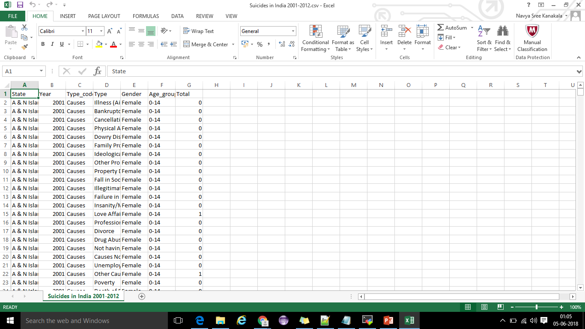

# mysql-spark-zeppelin
Bring suicide data from MySQL into Spark SQL and analyse it

## Objective

To build an application to decrease suicides death toll rate using MySQL, Spark and Zeppelin.

## Data description

1. Data refers to State/UT-wise distribution of suicide deaths by sex and age group due to causes like physical abuse, bankruptcy,   
   divorce, professional etc.

2. Dataset consists of 237519 rows and 7 columns

3. Consists information of State, Year, Type, Gender, Age_group etc

   

## Tools & technologies used

Best suited technologies:

1. MySQL

2. Apache Spark

3. Apache Zeppelin

## Commands

1) Loading data to MySQL 

   a) Change the password of root user to avoid errors in Spark SQL while connecting to MySQL.(Login as root user to perform all       
      operations) 
   
      Step 1: Stop the MySQL service 
      
              /etc/init.d/mysqld stop 
      
      Step 2: Start MySQL without a password after executing below command 
      
              mysqld_safe --skip-grant-tables & mysql –uroot
      
      Step 3: Set a new MySQL root password use mysql; update user set password=PASSWORD("root") where User='root'; 
              
              flush privileges; 
              quit;    
      
      Step 4: Stop and start MySQL service 
              
              /etc/init.d/mysqld stop 
              /etc/init.d/mysqld start 
      
      Step 5: Login to MySQL with new password using below command 
              
              mysql –u root –p 
              Enter password: 

   b) Create a database upx in which create table for the required dataset(here suicides dataset) 
      
      ```
      create database upx; 
      use upx; 
      create table suicides (state varchar(50), year int, typecode varchar(50), type varchar(60), gender varchar(7), 
      agegroup varchar(50),total int); 
      ```

   c) One cannot directly load the data by placing the dataset in any location. Use the below command to find location to place dataset 
      
      ```
      show variables like "secure_file_prev"; 
      ```
      // which yields below output 
      
      ```
      Variable_name    | Value                    
      
      secure_file_priv | /mnt/var/lib/mysql-files/ 
      ```
 
   d) Move the dataset to above location 
   
      ```
      hdfs dfs –copyToLocal /user/hue/suicides.csv /mnt/var/lib/mysql-files/
      ```

   e) Load the dataset without header using below command 
   
      ```
      load data infile '/mnt/var/lib/mysql-files/suicides.csv' replace into table suicides fields terminated by ',' lines terminated by       '\n' ignore 1 lines;
      ```

   f) Grant privileges to root user to avoid access denied error in Spark
   
      ```
      GRANT ALL PRIVILEGES ON *.* TO 'root'@'ip-172-31-25-99.us-west2.compute.internal' IDENTIFIED BY 'root' WITH GRANT OPTION;  
      ```

2) Download mysql connector jar from below link and place it in local file system

   https://mvnrepository.com/artifact/mysql/mysql-connector-java/5.1.36  

3) Start spark shell using below command

   ```
   spark-shell --driver-class-path /home/ec2-user/mysql-connector-java5.1.36.jar --jars /home/ec2-user/mysql-connector-java-5.1.36.jar  
   
   ```
4) Connecting to MySQL from Spark SQL

```
spark.stop 
import org.apache.spark.{SparkContext,SparkConf} 
import org.apache.spark.sql.hive.HiveContext
import org.apache.spark.sql.SQLContext 
import org.apache.spark.sql.SaveMode  

val conf = new SparkConf().setMaster("local").setAppName("HiveContext") val sc = new SparkContext(conf); 
val hiveContext:SQLContext = new HiveContext(sc) 
hiveContext.setConf("hive.metastore.uris","thrift://ip-172-31-25-51:9083")  
val prop = new java.util.Properties 
prop.put("user","root") prop.put("password","root")
prop.put("driverClass","com.mysql.jdbc.Driver") 
val uri = "jdbc:mysql://ip-172-31-25-51:3306/upx" val table = "suicides"  
val suicides_DF = hiveContext.read.jdbc(uri,table,prop) 
suicides_DF.createOrReplaceTempView("suicides") 
suicides_DF.rdd.saveAsTextFile(“/user/ec2-user/folder”)            //saving the data in HDFS  
hiveContext.sql("select * from suicides").show
```

5) Problem statements 

   a. Most common suicide cause among females in India over the entire period 2001-2012  

   ```
   hiveContext.sql("select type,count(total) from suicides  where gender = 'Female' group by type order by count(total) desc").show; 
   ```

   b. State wise most common cause among males over the entire period  

   ```
   hiveContext.sql("select state,type,count(total) from suicides  where gender = 'Male' group by state,type order by count(total)  
   desc").show;  
   ```

   c. Age group wise most common cause among males and females  

   ```
   hiveContext.sql("select agegroup,type,gender,count(total) from suicides group by agegroup,type,gender order by count(total) 
   desc").show; 
   ```

   d. Total number of suicides per year per state 
   
   ```
   hiveContext.sql("select state,year,count(total) from suicides group by state,year").show;  
   ```

   e. Which age group is most effected by educational causes
   
   ```
   hiveContext.sql("select agegroup,count(total) from suicides where typecode like 'education%' group by agegroup order by count(total) 
   desc").show;
   ```

   f. Male suicide rate vs female suicide rate  
   
   ```
   hiveContext.sql("select gender,count(total) from suicides group by gender").show;
   ```

   g. Which state has more suicides over the entire period
   
   ```
   hiveContext.sql("select state,count(total) from suicides group by state order by count(total) desc").show; 
   ```

   h. Group by state, year, causes, & count of suicides  
   
   ```
   hiveContext.sql("select state,year,type,count(total) from suicides group by state,year,type").show;
   ```

   i. Group by agegroup, gender, & count of suicides
   
   ```
   hiveContext.sql("select agegroup,gender,count(total) from suicides group by agegroup,gender").show; 
   ```

   j. State wise most common cause of sudicides  
   
   ```
   hiveContext.sql("select state,type,count(total) from suicides group by state,type order by count(total) desc").show; 
   ```

   k. Which state has more suicides among females and males?
   
   ```
   hiveContext.sql("select state,gender,count(total) from suicides group by state,gender order by count(total) desc").show;
   ```

   l. Find suicides count cause wise(typecode)  

   ```
   hiveContext.sql(" select typecode,type,count(total) as suicides  from suicides group by typecode,type").show; 
   ```

   m. Which is the least cause for suicide  

   ```
   hiveContext.sql("select type,count(total) from suicides group by type order by count(total) asc").show; 
   ```

   n.List out various Categories of suicidal causes 
 
   ```
   hiveContext.sql("select typecode,type from suicides group by type,typecode").show;
   ```
  
## Future Possibilities

As data is stored in HDFS, MySQL tables, we can explore it in 2 ways:
 
 1. We can transfer data to Hive tables if any requirement arrives
    
    i) We can connect this data to any Web UIs and generate dashboards
 
    ii) And can share these dashboards to schools, NGOs to control death rates 

